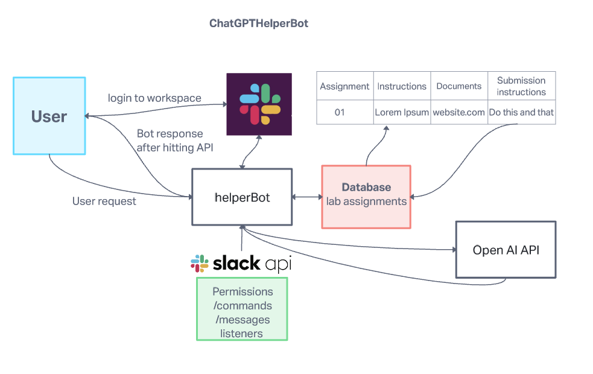
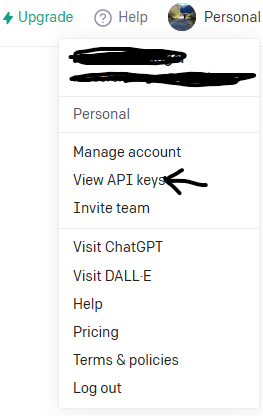
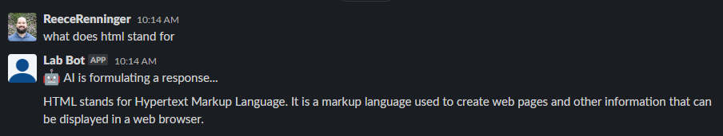
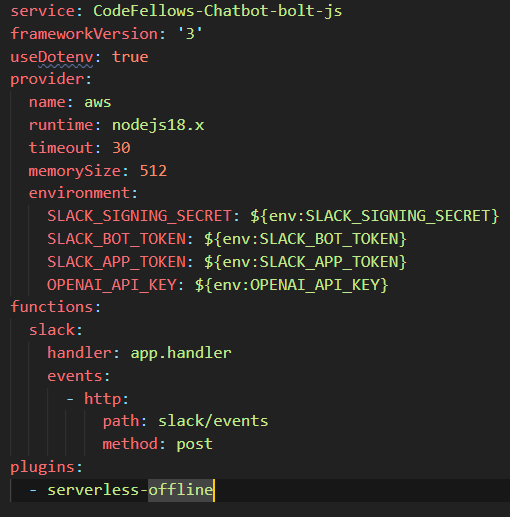

# Project: LetsChatItUpWithChatGPT

## # Authors: [Kao Saelor](https://github.com/CodingKao), [Kenya Womack](https://github.com/KenyaWomack), [Hayden Cooper](https://github.com/Hcooper23), [Tricia Sawyer](https://github.com/triciasawyer), [Donna Ada](https://github.com/donnaada), [Reece Renninger](https://github.com/ReeceRenninger)

## # Description

- We were tasked with generating a SlackBot connected to OpenAI for students to utilize.  The initial goal is to allow students the ability to prompt the slack bot with lab instructions to receive feedback or help. We hope to expand the bots capabilities or even implement additional bots that provide different functionalities after we hit MVP on the initial request.

## # Domain Modeling

This will be modified as needed through the progression of the project.  


## # Environmental Variables

| .env variable*               | SOURCE |  
| ---------------------------- | -------------- |  
| PORT                         | User Specified |  
| SLACK_SIGNING_SECRET         | Slack  <sub><sup>[🔗](https://api.slack.com/authentication/verifying-requests-from-slack)</sup></sub> |
| SLACK_BOT_TOKEN              | Slack <sub><sup>[🔗](https://api.slack.com/authentication/token-types#bot)</sup></sub> |
| APP_TOKEN                    | Slack <sub><sup>[🔗](https://api.slack.com/authentication/token-types#app)</sup></sub> |
| OPENAI_API_KEY               | OpenAI <sub><sup>[🔗](https://platform.openai.com/docs/api-reference/authentication)</sup></sub> |

_* .env.sample provided in repo. Rename file to `.env` and replace it with your tokens and port information_

## # Development Setup

1. Generate a simple GitHub repo, and clone down to your local machine. (you will want this ahead of time so you can implement code for the bot to communicate with for your built out slash commands and messages going forward)
2. [Download slack](https://slack.com/downloads/windows)
3. [Generate a workspace](https://slack.com/help/articles/206845317-Create-a-Slack-workspace) you have permissions to create apps in
4. Generate an app through the [slack api](https://api.slack.com/). If you are unfamiliar with generating a slack bot I advise you to follow the tutorial in the next step!
5. For a step by step process to create a bot with some message and slash command you can follow this [tutorial](https://blog.logrocket.com/build-a-slackbot-in-node-js-with-slacks-bolt-api/)
6. Within the above tutorial you will get a guide on setting up [ngrok](https://ngrok.com/), you should do this if you intend on deploying your app to aws lambda after you get your chat module working.
7. Once you have established your proof of life with any simple commands you'd like, you can begin developing your chat module connecting to [Open AI API](https://auth0.openai.com/u/signup/identifier?state=hKFo2SBUSTVZVTZIUDdsTUltbW9WN0dYN0tKZy1UajQxcGFHWqFur3VuaXZlcnNhbC1sb2dpbqN0aWTZIDlrLWpFd1FYbExsZ2g4TVpHSFJSWDFvdHdxRjM4Q0lHo2NpZNkgRFJpdnNubTJNdTQyVDNLT3BxZHR3QjNOWXZpSFl6d0Q)!
8. You will need to setup an account to be able to generate an Open AI API key. Once logged in you can go to the top right image and view your API keys, on the next window you will be able to create a new secret key. **NOTE: DO NOT EXPOSE THIS KEY TO GITHUB OR ANY PUBLIC FACING LOCATION.** If you expose your key it will be revoked and you must generate a new one.

9. You will need this key in the initial configuration of the chat bot as you can see within our [chatModule.js](./src/modules/chatModule.js). There are also multiple guides out there you can look up for how to generate a slack bot connected to Open AI API.
10. Once you have generated your chat bot and are able to get valid responses running locally such as:

You can begin the process of deploying!
11. We attempted to deploy our bot through multiple avenues with Render, Heroku, and Vercel. There are multiple [hosting providers](https://api.slack.com/docs/hosting), but we ultimately ended up using [AWS(Amazon Web Services)](https://aws.amazon.com/).
12. Ngrok was extremely helpful in testing locally before we went with the serverless route. A complete breakdown of this process can be found [here](https://slack.dev/bolt-js/deployments/aws-lambda).
13. We recommend following the guide as it helped us tremendously with navigating the deployment, however we have some modifications:
            
    When setting up your serverless.yml if you are using dotenv you need to add ```useDotenv: true``` like below:
    You can also implement timeouts and memory size if you choose to.  By enabling 
    

## # User Stories

1. As a user, I would like to be able to specify what language should be used for the lab

    Feature Tasks

        Users can specify the language that will be used for the lab
        SlackBot & OpenAI will provide answers to questions specific to a language

    Acceptance Tests

        Ensure that responses are specific to the language requested by the user
        Provide error message is Slack or OpenAI becomes unavailable

1. As a user, I want to be able to feed the SlackBot with lab assignments

    Feature Tasks:

        Users should be able to paste in the lab assignment

    Acceptance Tests

        Ensure that OpenAI sends a confirmation message when lab assignment received.
        Provide Error message if OpenAi is unavailable
        Provide Error message if SlackBot is unavailable

1. As a user, I want to be able to ask SlackBot a question that I might have regarding the lab assignment.

    Feature Tasks:

        Users should be able to ask SlackBot questions about the assignment
        SlackBot should respond to the user with answers

    Acceptance Tests

        Ensure that a response is generated after each question
        Provide Error message if OpenAi is unavailable
        Provide Error message if SlackBot is unavailable

1. As a user, I would like to be able to have SlackBot/ OpenAI provide clarification on a previous response

    Feature Tasks:

        Users should be able to ask SlackBot/OpenAI to elaborate more on a previous response.

    Acceptance Tests

        Ensure that OpenAI can remember its previous responses and explain/elaborate more/
        Provide Error message if OpenAi is unavailable
        Provide Error message if SlackBot is unavailable

1. As a user, I would like to be able to interact with ChatGPT from within a slack channel

    Feature Tasks

        Users can interact with ChatGPT using a specific slash command example '/chatGPT'

    Acceptance Task

        Provide error message if slash command fails to connect to OpenAI
        Ensure that slash commands are only enabled in specific chats (direct message vs channels)

### # References

- [Slack API](https://api.slack.com/)
- [Open AI API](https://openai.com/product#made-for-developers)
- [Building a slack bot tutorial](https://blog.logrocket.com/build-a-slackbot-in-node-js-with-slacks-bolt-api/)
- [Slack bot for generating blogs](https://youtu.be/an_LouGafXc)
- [Deploying slack bot to AWS Lambda](https://slack.dev/bolt-js/deployments/aws-lambda)
- Brook for coming up with the idea of a slack bot connected to Open AI to help students with lab work!
